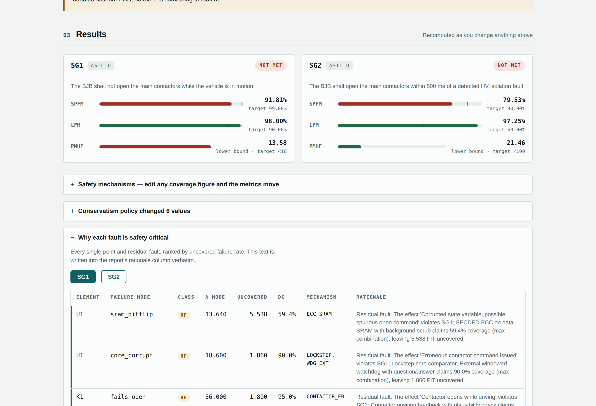
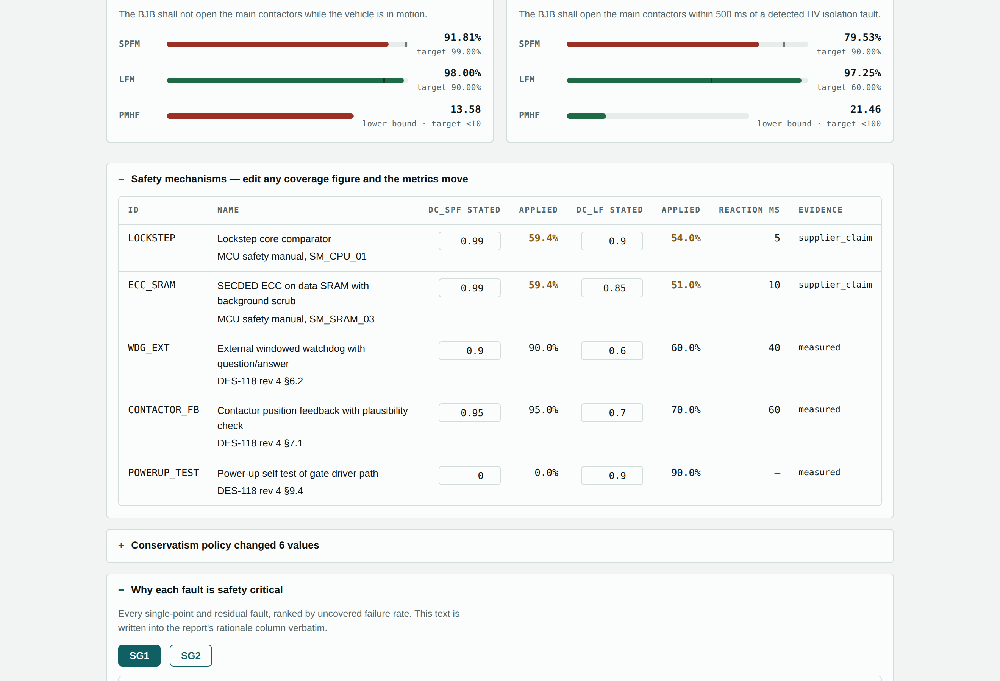

# fmeda-toolkit

> ISO 26262-5 hardware architectural metrics — SPFM, LFM, PMHF — computed from a versioned failure-rate table instead of a spreadsheet.

[](https://github.com/90insu/fmeda-toolkit/actions/workflows/ci.yml)
[](https://www.python.org/)
[](LICENSE)

### ▶ [Open the live demo](https://90insu.github.io/fmeda-toolkit/) — no install, runs entirely in your browser

[](https://90insu.github.io/fmeda-toolkit/)

Move the conservatism selector and the metrics move. Edit a diagnostic coverage figure and they move again. Press one button and you get an Excel report with the reasoning behind every classification written into it.

---

## Why this exists

Functional safety hardware metrics are computed, almost universally, in Excel. The analysis and the arithmetic end up fused inside a binary file: you cannot diff two revisions, you cannot see who changed a diagnostic coverage claim from 0.90 to 0.99, and you cannot review that change before it lands. Fault tree analysis has open-source tooling and scenario generation has `scenariogeneration`; FMEDA has commercial suites and ten thousand private spreadsheets.

This splits the two. The analysis becomes a text file that git tracks line by line —

```diff
-    dc_spf: 0.90
+    dc_spf: 0.99
```

— and the computation becomes a tested library. The arithmetic is the easy part; Excel does it fine. Reviewability is what's missing.

## Three ways to run it

| | |
|---|---|
| **Browser** | [The demo](https://90insu.github.io/fmeda-toolkit/), or open `docs/index.html` from a local copy. One file, no dependencies, no network. |
| **Command line** | `pip install -e .` then `python -m fmeda compute examples/bjb/fmeda.yaml` |
| **Library** | `from fmeda.metrics import compute` — the engine the other two call |

The bundled example is a **fictional** Battery Junction Box Controller. Every failure rate and every diagnostic coverage claim in it was invented.

```
  SG1 · ASIL D · FTTI 100 ms                     dc_combination: max
  ─────────────────────────────────────────────────────────────────────
  Element   λ (FIT)   λ_SPF    λ_RF   λ_MPF,L   λ_MPF,D     λ_S
  U1           62.0    0.00    2.68      0.31     59.01    0.00
  U3           48.0    0.00    0.72      2.16     33.12   12.00
  K1           90.0    0.00    2.93      0.00     55.57   31.50
  ─────────────────────────────────────────────────────────────────────
  SPFM  96.08%  (target 99.00%)   FAIL
  LFM   98.09%  (target 90.00%)   PASS
  PMHF   6.50 FIT lower bound — dual-point term not modelled
```

## What it does

**Computes** SPFM, LFM and a PMHF lower bound per safety goal, classifying every failure mode of every element as a safe fault, single-point fault, residual fault, or latent or detected multiple-point fault.

**Validates** things a spreadsheet cannot check:

- a diagnostic claiming single-point coverage it cannot react fast enough to justify (`reaction_time_ms > ftti_ms`)
- `independent` coverage combination without a written dependent-failure argument (ISO 26262-9 Clause 7)
- a 99% coverage claim resting on `estimated` evidence
- failure modes declared by the part but never classified by the analysis
- failure-mode fractions that don't sum to 1.0

**Explains** every classification. The rationale is generated *from* the classification, so the comment can never drift away from the number beside it:

> Residual fault. The effect 'Corrupted state variable, possible spurious open command' violates SG1; SECDED ECC on data SRAM with background scrub claims 59.4% coverage (max combination), leaving 5.538 FIT uncovered.

**Reports** to Excel — one sheet per safety goal, plus the mechanism register, the conservatism policy log, the review queue, the assumption register, and a provenance sheet. Metric cells are live formulas, so changing a coverage figure in the sheet moves SPFM.

## Conservatism policy

The 60 / 90 / 99 selector applies deterministic derating by evidence strength. **It is not a statistical confidence interval and not a model temperature** — the same inputs at the same level always give the same numbers. What it expresses is how much unverified coverage you are willing to credit.

| Evidence | 60 Nominal | 90 Conservative | 99 Worst case |
|---|---|---|---|
| measured / field_data | 1.00 | 1.00 | 1.00 |
| standard | 1.00 | 0.95 | 0.90 |
| supplier_claim | 1.00 | 0.90 | 0.00 |
| estimated / expert judgement | 1.00 | 0.60 | 0.00 |

Missing reference documents feed the arithmetic too: run without the supplier safety manual and every `supplier_claim` drops an evidence tier, because the document that would substantiate it isn't there.



## How it works

```
  src/fmeda/models.py    YAML → validated Analysis + part libraries
  src/fmeda/policy.py    conservatism derating            (deterministic)
  src/fmeda/metrics.py   classification → SPFM / LFM / PMHF (deterministic)
  src/fmeda/report.py    XLSX
  web/                   the browser build, assembled into docs/index.html
  app.py                 Streamlit front end, owns no arithmetic
```

Libraries are separate from analyses on purpose. A library says what a part does when it breaks and how often; an analysis says whether that matters in *this* design and what catches it. Merging them is what makes FMEDA spreadsheets rot.

Safety mechanisms are named objects rather than inlined coverage columns, so one ECC claim serving fifteen failure modes is one edit and one diff line. `dc_spf` and `dc_lf` are separate fields, because a power-up self test has zero single-point coverage against a 100 ms FTTI and 90% latent coverage — one number cannot say that.

See [docs/schema.md](docs/schema.md) for the input schema and [docs/dashboard.md](docs/dashboard.md) for the architecture.

## Testing

```bash
pip install -e ".[dashboard,dev]"
pytest          # 56 tests
python web/verify.py   # browser-vs-Python parity, needs playwright
```

Three checks beyond the unit tests, each added after a real defect got through:

- **Hand-computed fixtures.** The expected value in every metric assertion is written out as the arithmetic that produced it. A test whose expected value came from running the code proves only that the code still does what it did.
- **Browser parity.** The page carries its own copy of the metric logic, which can drift. `web/verify.py` drives it headlessly and compares against the Python at all three conservatism levels.
- **OOXML structural validation.** Excel enforces element ordering that openpyxl and LibreOffice silently tolerate. `web/validate_ooxml.py` checks the generated workbook against the schema's child sequences, so a file that only Excel would reject fails the build instead.

## Limitations

Read these before quoting any figure this tool produces.

- **PMHF is a lower bound.** Single-point and residual terms only; the dual-point failure term needs explicit DPF pair enumeration and is not modelled.
- **Failure rates are flat at the profile temperature.** IEC 61709 stress factors are not yet applied.
- **Schematic ingest is not built.** Both front ends run against the bundled YAML. Netlist parsing is the next milestone.
- **There is no AI proposal layer yet**, and when there is, nothing it proposes will enter a released FMEDA without a human ratifying it.
- **The bundled example is fictional throughout**, and it deliberately misses its ASIL D SPFM target — a first-pass architecture that doesn't close is a more useful fixture than one that does.

## Standards references

Clause numbers only. These documents are copyrighted and sold per seat; none of their text is reproduced here.

- **ISO 26262-5:2018** — hardware architectural metrics; target values in Tables 4, 5 and 6 (informative, and overridable in the analysis).
- **ISO 26262-9:2018** Clause 7 — dependent failure analysis, required before claiming `independent` coverage combination.
- **IEC 61709:2017** — current reference conditions and stress models.
- **SN 29500** — component failure rate data.
- **IEC TR 62380:2004** — **withdrawn 2017-02-17**, replaced by IEC 61709:2017. Selectable for comparison with legacy analyses only.

Default target values ship as defaults, not constants. Verify them against your own copy of the standard before relying on them.

## Contributing

Issues and pull requests welcome, particularly on failure-rate library coverage and netlist parsing. Run `pytest` before opening one.

## License

Apache-2.0. Chosen over MIT for the explicit patent grant, which matters in automotive.
